# MESIN VIRAL — Single Source of Truth
> Dokumentasi Arsitektur & Workflow Lengkap  
> Dibuat: 4 April 2026 | Versi Sistem: v0.4.0 | Diupdate: 5 April 2026
> Tenant Aktif: `ryan_andrian` | Niche: rotasi (ocean_mysteries, fun_facts, dark_history, universe_mysteries)

---

## DAFTAR ISI

1. [Ringkasan Sistem](#1-ringkasan-sistem)
2. [Struktur Folder & File](#2-struktur-folder--file)
3. [Arsitektur Sistem](#3-arsitektur-sistem)
4. [Alur Kerja Sistem (Step-by-Step)](#4-alur-kerja-sistem-step-by-step)
5. [Diagram Alir (Mermaid)](#5-diagram-alir-mermaid)
6. [Inventarisir Infrastruktur](#6-inventarisir-infrastruktur)
7. [Database Schema (Supabase)](#7-database-schema-supabase)
8. [Environment Variables](#8-environment-variables)
9. [Konfigurasi Tenant](#9-konfigurasi-tenant)
10. [Identifikasi Sampah Coding](#10-identifikasi-sampah-coding)
11. [Lingkungan Production Server](#11-lingkungan-production-server)
12. [Catatan Teknis](#12-catatan-teknis)
13. [Status Fitur & Roadmap](#13-status-fitur--roadmap)

---

## 1. RINGKASAN SISTEM

**MesinViral.com** adalah platform SaaS multi-tenancy berbasis AI yang memproduksi konten video viral secara otomatis, dari riset tren hingga video terpublikasi di YouTube Shorts — tanpa intervensi manual.

### Karakteristik Utama

| Aspek | Detail |
|-------|--------|
| **Tipe** | SaaS multi-tenant, pipeline otomatis |
| **Output** | YouTube Shorts (9:16 portrait, 1080×1920) |
| **Frekuensi** | 5× sehari via cron (production) |
| **Durasi video** | 45–180 detik (target ~58–111 detik) |
| **Bahasa** | Inggris (`en`) — default |
| **Niche aktif** | `universe_mysteries`, `fun_facts`, `dark_history`, `ocean_mysteries` |
| **AI Engine** | OpenAI GPT-4o-mini (script, hook, topic) |
| **TTS** | ElevenLabs → OpenAI TTS → Edge TTS (fallback berlapis) |
| **Visual** | Pexels stock footage / DALL-E 3 (AI Image) |
| **Render** | FFmpeg, H.264, 1080×1920, 30fps, 4000k bitrate |
| **Database** | Supabase (PostgreSQL) |
| **Storage** | Cloudflare R2 (musik) |
| **Distribusi** | YouTube API (OAuth2) |

### Statistik Pipeline (dari log terbaru)
- Run ID: `ryan_andrian_1774943546` (31 Maret 2026)
- Durasi eksekusi: **735,9 detik (~12 menit)**
- Ukuran video output: **55,6 MB**
- Durasi video: **111,87 detik**
- Hook score: **92/100**
- Word timestamps: **216 kata**
- Signals terkumpul: **43 sinyal** dari 5 sumber tren

---

## 2. STRUKTUR FOLDER & FILE

```
viral-machine/
│
├── .env                          # Secrets produksi (JANGAN commit)
├── .env.example                  # Template environment variables
├── .gitignore                    # Log, pycache, credentials, .env diabaikan
├── requirements.txt              # Python dependencies
├── pyproject.toml                # Metadata project (Poetry config)
│
├── scripts/
│   ├── daily_run.sh              # Shell script pemanggil pipeline via cron
│   ├── fetch_analytics.sh        # Cron harian: pull YouTube Analytics → Supabase
│   ├── compute_insights.sh       # Cron mingguan: compute channel_insights
│   ├── compute_insights.py       # Runner: PerformanceAnalyzer().compute_and_store()
│   ├── reauth_youtube.py         # Re-auth OAuth per channel (jalankan lokal, butuh browser)
│   └── seed_music_library.py     # Utility: upload musik ke R2 + insert Supabase
│
├── src/
│   ├── __init__.py               # Empty package init
│   │
│   ├── config/
│   │   ├── __init__.py
│   │   └── tenant_config.py      # TenantRunConfig + TenantConfigManager (Supabase)
│   │
│   ├── intelligence/
│   │   ├── __init__.py
│   │   ├── config.py             # Legacy TenantConfig + NICHES + SystemConfig
│   │   ├── trend_radar.py        # Agregasi tren dari 5 sumber
│   │   ├── niche_selector.py     # Pemilihan topik viral via AI (GPT-4o-mini)
│   │   ├── script_engine.py      # Generasi script 8-section via AI
│   │   ├── script_analyzer.py    # Analisis kualitas script (skor viral)
│   │   └── hook_optimizer.py     # Optimasi hook dengan 5 formula
│   │
│   ├── production/
│   │   ├── __init__.py
│   │   ├── tts_engine.py         # TTS orchestrator + fallback
│   │   ├── visual_assembler.py   # Visual orchestrator + fallback
│   │   └── video_renderer.py     # FFmpeg pipeline + karaoke caption
│   │
│   ├── providers/
│   │   ├── __init__.py
│   │   ├── llm/
│   │   │   ├── __init__.py
│   │   │   ├── base.py           # Abstract LLM provider
│   │   │   ├── openai.py         # OpenAI GPT provider (aktif)
│   │   │   └── claude.py         # Anthropic Claude provider (TIDAK DIPAKAI)
│   │   ├── tts/
│   │   │   ├── __init__.py
│   │   │   ├── base.py           # Abstract TTS provider
│   │   │   ├── edge_tts.py       # Microsoft Edge TTS (gratis, last resort)
│   │   │   ├── elevenlabs.py     # ElevenLabs TTS (premium, default target)
│   │   │   └── openai_tts.py     # OpenAI TTS (mid-tier)
│   │   ├── visual/
│   │   │   ├── __init__.py
│   │   │   ├── base.py           # Abstract Visual provider
│   │   │   ├── pexels.py         # Pexels stock footage (default)
│   │   │   ├── ai_image.py       # DALL-E 3 + Flux Schnell (opsional)
│   │   │   └── ai_video.py       # AI Video provider (DISABLED v0.2)
│   │   └── music/
│   │       ├── __init__.py
│   │       └── music_selector.py # Pemilihan track dari Supabase music_library
│   │
│   ├── distribution/
│   │   ├── __init__.py
│   │   └── youtube_publisher.py  # Upload ke YouTube Shorts via API
│   │
│   ├── utils/
│   │   ├── __init__.py
│   │   ├── supabase_writer.py    # Fire-and-forget writer ke Supabase
│   │   └── storage_cleaner.py    # Auto-cleanup file setelah pipeline
│   │
│   ├── orchestrator/
│   │   ├── __init__.py
│   │   └── pipeline.py           # Master controller — menjalankan semua step
│   │
│   └── analytics/
│       ├── __init__.py
│       ├── channel_analytics.py  # Pull YouTube Analytics API → Supabase video_analytics
│       └── performance_analyzer.py # Compute channel_insights — self-learning engine
│
├── logs/                         # Runtime files (diabaikan git)
│   ├── pipeline_{run_id}.json    # Execution report per run
│   ├── signals_{tenant}.json     # Trend signals hasil scan
│   ├── topics_{tenant}.json      # Topik terpilih oleh AI
│   ├── scripts_{tenant}.json     # Script yang digenerate
│   ├── audio_{tenant}_{ts}.mp3   # Audio TTS sementara
│   ├── video_{tenant}_{ts}.mp4   # Video final sebelum upload
│   ├── thumbnail_{run_id}.jpg    # Thumbnail dari hook frame
│   ├── clips_{tenant}/           # Clip video sementara
│   ├── subtitles.ass             # File subtitle ASS (debug)
│   └── cron_YYYYMMDD.log         # Log cron harian (production)
│
├── tokens/                       # OAuth tokens per channel (diabaikan git)
│   └── {channel_id}.json          # token YouTube per channel
├── token_youtube.json            # Legacy token — backward compat fallback
└── youtube_credentials.json      # OAuth credentials YouTube (diabaikan git)
```

### Tabel Fungsi Semua File Python

| File | Layer | Fungsi Utama |
|------|-------|-------------|
| `src/orchestrator/pipeline.py` | Orchestrator | Master controller: menjalankan 7 step pipeline + QC + publish + cleanup |
| `src/config/tenant_config.py` | Config | Load & cache `TenantRunConfig` dari Supabase; fallback ke defaults |
| `src/intelligence/config.py` | Intelligence | `TenantConfig` legacy (entry point), `NICHES` dict, `SystemConfig` |
| `src/intelligence/trend_radar.py` | Intelligence | Scan tren dari Google Trends, YouTube, News, HackerNews, Wikipedia |
| `src/intelligence/niche_selector.py` | Intelligence | Pilih 5 topik viral via GPT-4o-mini; cegah duplikat dari Supabase |
| `src/intelligence/script_engine.py` | Intelligence | Generate script 8-section (hook→CTA) via GPT-4o-mini; retry 3× |
| `src/intelligence/script_analyzer.py` | Intelligence | Score script 0–100 di 6 dimensi; feedback untuk retry |
| `src/intelligence/hook_optimizer.py` | Intelligence | Generate 5 varian hook; pilih pemenang berdasarkan scroll_stop_power |
| `src/production/tts_engine.py` | Production | Orkestrasi TTS + fallback berlapis; kembalikan audio + word timestamps |
| `src/production/visual_assembler.py` | Production | Download/generate 6 clip visual; fallback ke cache/black screen |
| `src/production/video_renderer.py` | Production | FFmpeg pipeline: combine clip + audio + karaoke caption → MP4 1080×1920 |
| `src/providers/llm/base.py` | Provider | Abstract class LLM provider |
| `src/providers/llm/openai.py` | Provider | OpenAI GPT (sync + async); gpt-4o-mini default |
| `src/providers/llm/claude.py` | Provider | Claude Sonnet (implementasi ada, **tidak dipakai**) |
| `src/providers/tts/base.py` | Provider | Abstract class TTS provider |
| `src/providers/tts/edge_tts.py` | Provider | Microsoft Edge TTS; gratis; SubMaker untuk timestamps |
| `src/providers/tts/elevenlabs.py` | Provider | ElevenLabs; kualitas terbaik; char→word timestamp conversion |
| `src/providers/tts/openai_tts.py` | Provider | OpenAI TTS; tidak ada timestamps native |
| `src/providers/visual/base.py` | Provider | Abstract class Visual provider |
| `src/providers/visual/pexels.py` | Provider | Pexels stock footage; filter durasi & ukuran |
| `src/providers/visual/ai_image.py` | Provider | DALL-E 3 / Flux Schnell; section-aware prompt |
| `src/providers/visual/ai_video.py` | Provider | **DISABLED** — raise `VisualError` saat dipanggil |
| `src/providers/music/music_selector.py` | Provider | Deteksi mood dari script via keywords (dari tabel `moods`); query `music_library` per niche+mood; download dari R2 |
| `src/distribution/youtube_publisher.py` | Distribution | Upload video + thumbnail ke YouTube Shorts via Google API |
| `src/utils/supabase_writer.py` | Utils | Fire-and-forget writer; catat video, QC fail, pipeline error |
| `src/utils/storage_cleaner.py` | Utils | Hapus clips (setelah render), video (setelah upload), log lama |
| `src/analytics/channel_analytics.py` | Analytics | Pull YouTube Data API v3 + Analytics API v2 → upsert `video_analytics` |
| `src/analytics/performance_analyzer.py` | Analytics | Compute niche_weights, top_hooks, avoid_patterns → upsert `channel_insights` |
| `scripts/daily_run.sh` | Scripts | Shell wrapper cron; eksekusi pipeline dengan flag `--publish` |
| `scripts/fetch_analytics.sh` | Scripts | Cron harian 06:00 UTC; pull YouTube Analytics untuk semua video published |
| `scripts/compute_insights.sh` | Scripts | Cron mingguan Senin 07:00 UTC; hitung channel_insights dari video_analytics |
| `scripts/reauth_youtube.py` | Scripts | Re-auth OAuth per channel; jalankan LOKAL (butuh browser) |
| `scripts/seed_music_library.py` | Scripts | Upload MP3 lokal → R2; insert metadata ke Supabase `music_library`; validasi niche+mood dari Supabase (tidak hardcode) |

---

## 3. ARSITEKTUR SISTEM

### Lapisan Arsitektur (Clean Architecture)

```
┌─────────────────────────────────────────────────────────┐
│                    ORCHESTRATOR LAYER                    │
│                    pipeline.py                           │
│           (Master controller, step coordinator)          │
└──────────────────────────┬──────────────────────────────┘
                            │
          ┌─────────────────┼─────────────────┐
          ▼                 ▼                 ▼
┌──────────────┐  ┌──────────────┐  ┌──────────────────┐
│ INTELLIGENCE │  │  PRODUCTION  │  │   DISTRIBUTION   │
│    LAYER     │  │    LAYER     │  │      LAYER       │
│              │  │              │  │                  │
│ TrendRadar   │  │ TTSEngine    │  │ YouTubePublisher │
│ NicheSelector│  │ VisualAssem. │  │ (TikTok: Phase8) │
│ ScriptEngine │  │ VideoRenderer│  │ (IG: Phase 8)    │
│ HookOptimizer│  │              │  │                  │
│ ScriptAnalyz.│  └──────┬───────┘  └──────────────────┘
└──────┬───────┘         │
       │         ┌───────▼────────────────────┐
       │         │      PROVIDER LAYER         │
       │         │                             │
       │         │ LLM:    OpenAI / Claude(❌) │
       │         │ TTS:    ElevenLabs/OAI/Edge │
       │         │ Visual: Pexels/DALL-E/Flux  │
       │         │ Music:  Supabase+R2         │
       │         └───────────────────────────-─┘
       │
       └──────────────────────┐
                              ▼
                   ┌──────────────────┐
                   │    UTILS LAYER    │
                   │                  │
                   │ SupabaseWriter   │
                   │ StorageCleaner   │
                   └──────────────────┘
                              │
                   ┌──────────▼──────────┐
                   │  CONFIG LAYER       │
                   │                     │
                   │ TenantConfigManager │
                   │ (Supabase → .env    │
                   │  → hardcoded)       │
                   └─────────────────────┘
```

### Provider Pattern (Pluggable + Fallback)

Setiap layer produksi memiliki provider abstrak yang dapat ditukar:

```
TTSEngine
  ├─ Primary:   elevenlabs  (kualitas terbaik, berbayar)
  ├─ Fallback1: openai_tts  (mid-tier, berbayar)
  └─ Fallback2: edge_tts    (gratis, Microsoft, SELALU tersedia)

VisualAssembler
  ├─ Primary:   pexels       (stock video gratis)
  ├─ Alt:       ai_image:dall-e-3  (AI generated, $$$)
  ├─ Alt:       ai_image:flux-schnell (AI generated, $$)
  ├─ Fallback1: clips cache (dari run sebelumnya)
  └─ Fallback2: black screen MP4 (generated secara lokal)

LLM
  ├─ Primary:  openai / gpt-4o-mini
  └─ (Claude: diimplementasi tapi tidak terhubung ke pipeline)
```

---

## 4. ALUR KERJA SISTEM (STEP-BY-STEP)

### Input → Output: Dari Tren ke Video Published

```
TRIGGER (cron: scripts/daily_run.sh)
    │
    ▼
[INIT] Load TenantRunConfig dari Supabase
       tenant_id: "ryan_andrian"
       niche:     "universe_mysteries" (fixed atau random dari pool)
       providers: tts_provider, visual_provider, llm_model
    │
    ▼
[STEP 1] TREND RADAR — Scan 5 Sumber
    ├─ Google Trends     → 5 keyword, avg interest + momentum
    ├─ YouTube Search    → 10 video trending (7 hari terakhir)
    ├─ Google News       → 20 artikel relevan (RSS)
    ├─ HackerNews        → 10 cerita top (HN Algolia API)
    └─ Wikipedia Trending → 10 artikel populer
    Output: signals_{tenant}.json (~43 sinyal)
    │
    ▼
[STEP 2] NICHE SELECTOR — Pilih Topik Terbaik
    ├─ AI (GPT-4o-mini) analisis signals
    ├─ Hasilkan 5 topik dengan viral_score (VIRAL_SCORE_WEIGHTS: volume 25%, momentum 25%, emosi 20%, kompetisi 15%, evergreen 15%)
    ├─ Cek duplikat vs Supabase (lookback 30 hari, topic_slug normalisasi)
    └─ Safety-net LRU jika semua topik duplikat
    Output: topics_{tenant}.json (top 5 topik)
    │
    ▼
[STEP 3] SCRIPT ENGINE — Generate Narasi
    ├─ Ambil topik #1 dari Step 2
    ├─ AI (GPT-4o-mini) generate script 8 section dengan timing:
    │     hook (3s) → mystery_drop (5s) → build_up (12s)
    │     → pattern_interrupt (2s) → core_facts (15s)
    │     → curiosity_bridge (3s) → climax (8s) → cta (3s)
    │     Total: ~51 detik konten + trailing_silence (2.5s)
    ├─ Voice profile per niche (authoritative, mysterious, dramatic, dll)
    ├─ ScriptAnalyzer score 6 dimensi (min 75/100)
    └─ Retry hingga 3× jika skor < 75 (dengan feedback weak areas)
    Output: script dict dengan full_script, sections, word_count
    │
    ▼
[STEP 4] HOOK OPTIMIZER — Optimasi Hook
    ├─ AI (GPT-4o-mini) generate 5 varian hook dengan formula berbeda:
    │     question, impossible_claim, stat_shock, mystery_tease, fear_trigger
    ├─ Score setiap varian: curiosity, shock, clarity, scroll_stop_power
    └─ Pilih pemenang (max scroll_stop_power), update script.hook
    Output: script dict dengan hook diperbarui (contoh score 92/100)
    │
    ▼
[STEP 5] TTS ENGINE — Generate Audio
    ├─ Pilih provider (ElevenLabs → OpenAI TTS → Edge TTS)
    ├─ Voice per niche (contoh: universe_mysteries → en-US-GuyNeural / Adam)
    ├─ Generate MP3 dari full_script
    ├─ Ekstrak word timestamps (98% akurat dari ElevenLabs; SubMaker dari Edge TTS)
    └─ Hitung durasi audio (ffprobe)
    Output: audio_{tenant}_{ts}.mp3 + list word_timestamps (contoh: 216 kata)
    │
    ▼
[STEP 6] VISUAL ASSEMBLER — Kumpulkan Visual
    ├─ Ekstrak keyword dari setiap section script
    ├─ Download/generate 6 clip (1 per section script)
    ├─ Provider default: Pexels (filter ≤15s ideal, max 150MB)
    ├─ Jika ai_image: generate section-aware DALL-E 3 prompt per index
    │     index 0 (hook): dramatic, tension-filled, scroll-stopping
    │     index 1 (mystery): mysterious, unsettling, low key lighting
    │     ... dst per section
    ├─ Scale timing clip ke audio_duration
    └─ Fallback: cache → black screen (pipeline TIDAK pernah crash)
    Output: [clip_0.mp4, clip_1.mp4, ..., clip_5.mp4]
    │
    ▼
[STEP 7] VIDEO RENDERER — Render Final
    ├─ Build karaoke caption ASS dari word_timestamps
    │     Kata aktif: #FFD700 (kuning), kata lain: #FFFFFF (putih)
    │     Max 2 baris, max 4 kata/baris, bottom margin 150px
    ├─ FFmpeg pipeline:
    │     concat 6 clip → scale 1080×1920 (pad letterbox)
    │     → overlay audio → burn subtitle → encode H.264/AAC
    └─ Spesifikasi output: 1080×1920, 30fps, 4000k vbitrate, 192k abitrate
    Output: video_{tenant}_{ts}.mp4 (contoh: 55.6 MB, 111.87 detik)
    │
    ▼
[s72] THUMBNAIL — Extract Frame
    ├─ Copy hook_frame_img.jpg dari clips_dir ke logs/
    └─ Path disimpan di result dict untuk diupload bersama video
    Output: thumbnail_{run_id}.jpg
    │
    ▼
[CLEANUP-1] Hapus folder clips mentah (setelah render berhasil)
    │
    ▼
[PRE-PUBLISH QC] — 4 Checks Wajib
    ├─ ✅ Check 1: File size ≥ 5 MB (render tidak korup)
    ├─ ✅ Check 2: Durasi ≥ 45 detik (minimum Shorts layak)
    ├─ ✅ Check 3: Durasi ≤ 180 detik (batas YouTube Shorts)
    └─ ✅ Check 4: ≥ 6 clips berhasil (semua scene ada)
    GAGAL → write_qc_failed() ke Supabase → hapus video → STOP
    LULUS → lanjut ke PUBLISH
    │
    ▼
[PUBLISH] YouTube Shorts
    ├─ Build metadata: title (max 100 char), description (max 4500 char)
    ├─ Tags: topic-specific + niche hashtags + universal (#shorts, #viral)
    ├─ Category: 28 (Science & Tech) untuk universe_mysteries
    ├─ Upload video via MediaFileUpload (resumable upload)
    ├─ Upload thumbnail
    ├─ Supabase write_video() — catat video_id, URL, hook, viral_score
    └─ Return video_id + URL YouTube
    │
    ▼
[CLEANUP-2] Hapus video final (setelah semua platform upload berhasil)
    │
    ▼
[CLEANUP-3] Hapus log lama (JSON > 30 hari, MP3 > 7 hari)
    │
    ▼
[REPORT] Tulis logs/pipeline_{run_id}.json (full execution log)
    │
    ▼
SELESAI — Video live di YouTube
```

---

## 5. DIAGRAM ALIR (MERMAID)

```mermaid
flowchart TD
    A([CRON TRIGGER\ndaily_run.sh]) --> B[Load TenantRunConfig\nSupabase → .env → defaults]
    B --> C[STEP 1\nTrendRadar.scan\n5 sumber tren]
    C --> D[STEP 2\nNicheSelector.select\nGPT-4o-mini + deduplikasi]
    D --> E[STEP 3\nScriptEngine.generate\n8 section script]
    E --> F{Viral score\n≥ 75?}
    F -- Tidak, retry --> E
    F -- Ya --> G[STEP 4\nHookOptimizer.optimize\n5 varian hook]
    G --> H[STEP 5\nTTSEngine.generate\nMP3 + word timestamps]
    H --> I{Provider OK?}
    I -- ElevenLabs gagal --> J[OpenAI TTS]
    J -- Gagal --> K[Edge TTS]
    I -- OK --> L[STEP 6\nVisualAssembler\n6 clips]
    K --> L
    L --> M{Visual OK?}
    M -- Gagal --> N[Fallback:\nCache / Black Screen]
    M -- OK --> O[STEP 7\nVideoRenderer\nFFmpeg MP4 1080x1920]
    N --> O
    O --> P[Save Thumbnail\nhook_frame_img.jpg]
    P --> Q[Hapus Clips]
    Q --> R{Pre-publish QC\n4 checks}
    R -- Gagal --> S[write_qc_failed\nSupabase]
    S --> T[Hapus Video]
    R -- Lulus --> U[YouTubePublisher\nupload + thumbnail]
    U --> V[write_video\nSupabase]
    V --> W[Hapus Video]
    W --> X[Cleanup Log Lama]
    X --> Y([SELESAI\nVideo Live di YouTube])
    T --> X
```



---

## 6. INVENTARISIR INFRASTRUKTUR

### 6.1 OpenAI API
| Parameter | Detail |
|-----------|--------|
| **Tujuan** | Script generation, topic selection, hook optimization, script analysis |
| **Endpoint** | `https://api.openai.com/v1/chat/completions` |
| **Model default** | `gpt-4o-mini` |
| **Model premium** | `gpt-4o` (tersedia di config) |
| **Auth** | `OPENAI_API_KEY` (Bearer token) |
| **Rate limit** | 3500 requests/menit (Tier 1) |
| **Format respons** | `response_format={"type": "json_object"}` — structured output |
| **Retry logic** | 3× dengan exponential backoff (di ScriptEngine) |
| **Estimasi cost/run** | ~$0.16 (gpt-4o-mini: $0.15/1M input, $0.60/1M output) |
| **Calls per pipeline** | 4× (NicheSelector + ScriptEngine + ScriptAnalyzer + HookOptimizer) |

### 6.2 ElevenLabs TTS
| Parameter | Detail |
|-----------|--------|
| **Tujuan** | Text-to-speech audio dengan kualitas premium |
| **Auth** | `ELEVENLABS_API_KEY` |
| **Akurasi timestamps** | ~98% (char → word conversion) |
| **Voice per niche** | `universe_mysteries` → Adam (`pNInz6obpgDQGcFmaJgB`), `fun_facts` → Rachel, `dark_history` → Arnold, `ocean_mysteries` → Bella |
| **Status** | Provider prioritas pertama (primary TTS) |
| **Fallback ke** | OpenAI TTS → Edge TTS |

### 6.3 Microsoft Edge TTS
| Parameter | Detail |
|-----------|--------|
| **Tujuan** | TTS gratis sebagai last-resort fallback |
| **Library** | `edge-tts==7.2.8` |
| **Auth** | Tidak perlu — menggunakan infrastructure Microsoft |
| **Timestamps** | Via SubMaker (akurasi ~95%) |
| **Voice per niche** | `universe_mysteries`/`ocean_mysteries` → `en-US-GuyNeural`, `fun_facts` → `en-US-JennyNeural`, `dark_history` → `en-US-ChristopherNeural` |
| **Keunggulan** | SELALU tersedia, gratis, tidak ada rate limit |

### 6.4 Pexels Stock Footage
| Parameter | Detail |
|-----------|--------|
| **Tujuan** | Download stock video clip sebagai visual default |
| **Endpoint** | `https://api.pexels.com/videos/search` |
| **Auth** | `PEXELS_API_KEY` (header) |
| **Filter** | Prioritas durasi ≤15s → ≤30s → any; max file 150MB |
| **Rate limit** | Sleep 0.5s per query |
| **Fallback ke** | Clips cache → black screen |

### 6.5 Supabase (PostgreSQL)
| Parameter | Detail |
|-----------|--------|
| **Tujuan** | Config tenant, pencatatan video, deteksi duplikat, music library |
| **URL** | `SUPABASE_URL` |
| **Auth** | `SUPABASE_KEY` (JWT anon key) |
| **Library** | `supabase==2.28.3` |
| **Pattern akses** | Fire-and-forget (gagal tidak menghentikan pipeline) |
| **Tables aktif** | `tenant_configs`, `videos`, `qc_failed`, `failed_runs`, `music_library`, `moods`, `niches` |
| **Cache** | In-memory cache di `TenantConfigManager._cache` |

### 6.6 Cloudflare R2
| Parameter | Detail |
|-----------|--------|
| **Tujuan** | Storage musik background (niche+mood based) |
| **Endpoint** | `R2_ENDPOINT` (custom domain r2.cloudflarestorage.com) |
| **Auth** | `R2_ACCESS_KEY` + `R2_SECRET_KEY` + `R2_ACCOUNT_ID` |
| **Library** | `boto3` (S3-compatible API) |
| **Bucket** | `R2_BUCKET=viral-machine` |
| **Key pattern** | `music/{niche}/{mood}/{filename}.mp3` |
| **Status** | Aktif untuk musik; belum digunakan untuk video backup |

### 6.7 YouTube Data API v3
| Parameter | Detail |
|-----------|--------|
| **Tujuan 1** | Upload video + thumbnail ke YouTube Shorts |
| **Tujuan 2** | Search video trending (TrendRadar - STEP 1) |
| **Auth upload** | OAuth2 token file (`token_youtube.json`) — auto-refresh |
| **Auth search** | `YOUTUBE_API_KEY` (API key biasa) |
| **Library** | `google-api-python-client` + `google-auth-oauthlib` |
| **Upload method** | `MediaFileUpload` (resumable, chunksize 50MB) |
| **Rate limit** | Quota 10.000 unit/hari; search = 100 unit, upload = 1600 unit |
| **Sleep** | 0.5s per search query (TrendRadar) |

### 6.8 Google Trends (pytrends)
| Parameter | Detail |
|-----------|--------|
| **Tujuan** | Ambil data interest + momentum keyword niche |
| **Library** | `pytrends==4.9.2` |
| **Auth** | Tidak perlu (scraping publik) |
| **Rate limit handling** | Exponential backoff: 5s → 10s → 60s + jitter, max 3× retry |
| **Error 429** | Ditangani otomatis dengan sleep bertahap |

### 6.9 Google News (RSS)
| Parameter | Detail |
|-----------|--------|
| **Tujuan** | Ambil artikel berita terkini per niche |
| **Library** | `feedparser==6.0.12` |
| **Endpoint** | Google News RSS `rss.google.com/news/rss/search?q=...&hl=en` |
| **Auth** | Tidak perlu |

### 6.10 HackerNews API
| Parameter | Detail |
|-----------|--------|
| **Tujuan** | Ambil top stories HN yang relevan |
| **Endpoint** | `https://hn.algolia.com/api/v1/search` |
| **Auth** | Tidak perlu |
| **Sleep** | 0.1s per story |

### 6.11 Wikipedia API
| Parameter | Detail |
|-----------|--------|
| **Tujuan** | Artikel Wikipedia trending |
| **Endpoint** | Wikimedia REST API (`wikimedia.org/api/rest_v1/metrics/pageviews`) |
| **Auth** | Tidak perlu |
| **Retry** | 2 tanggal berbeda jika data belum update |

### 6.12 Replicate (Opsional)
| Parameter | Detail |
|-----------|--------|
| **Tujuan** | AI image generation alternatif (Flux Schnell) |
| **Auth** | `REPLICATE_API_TOKEN` |
| **Model** | `black-forest-labs/flux-schnell` |
| **Status** | Tersedia di `ai_image.py`, aktif jika `visual_provider=ai_image:flux-schnell` |

### 6.13 FFmpeg (System Dependency)
| Parameter | Detail |
|-----------|--------|
| **Tujuan** | Video encoding, audio mixing, subtitle burn-in, frame extraction |
| **Versi** | Tidak dikunci (sistem) |
| **Install** | `apt-get install ffmpeg` |
| **Output codec** | H.264 video, AAC audio |
| **Penggunaan** | `subprocess.run()` — synchronous, blocking |
| **Tools** | `ffmpeg` (encode) + `ffprobe` (metadata/durasi) |

---

## 7. DATABASE SCHEMA (SUPABASE)

### Tabel `tenant_configs` — Konfigurasi Tenant
```sql
tenant_id               VARCHAR    PRIMARY KEY   -- ID unik tenant
plan_type               VARCHAR                  -- 'starter' | 'pro' | 'agency'
niche                   VARCHAR                  -- Niche konten (dari AVAILABLE_NICHES)
niche_mode              VARCHAR                  -- 'fixed' | 'random'
niche_pool              JSONB                    -- Array niche jika mode=random
language                VARCHAR    DEFAULT 'en'
videos_per_day          INT        DEFAULT 1
publish_platforms       JSONB                    -- Array: ['youtube']
publish_slots           JSONB                    -- Array UTC times: ['13:00']
production_cron         VARCHAR    DEFAULT '0 13 * * *'
analytics_cron          VARCHAR

-- Visual
visual_provider         VARCHAR    DEFAULT 'pexels'
visual_mode             VARCHAR    DEFAULT 'video'  -- 'video'|'ai_image:dall-e-3'|'ai_image:flux-schnell'
visual_max_clip_mb      INT        DEFAULT 50
visual_api_key          VARCHAR                  -- Tenant-specific API key (opsional)
visual_ai_model         VARCHAR

-- TTS
tts_provider            VARCHAR    DEFAULT 'edge_tts'
tts_voice               VARCHAR    DEFAULT 'en-US-GuyNeural'
tts_api_key             VARCHAR                  -- Tenant-specific API key (opsional)
tts_voice_per_niche     JSONB                    -- {niche: voice_id} mapping
tts_voice_settings      JSONB
tts_fallback_provider   VARCHAR    DEFAULT 'edge_tts'
music_enabled           BOOLEAN    DEFAULT false
music_volume            FLOAT      DEFAULT 0.10

-- LLM
llm_provider            VARCHAR    DEFAULT 'openai'
llm_model               VARCHAR    DEFAULT 'gpt-4o-mini'
llm_api_key             VARCHAR
llm_script_fallback     VARCHAR    DEFAULT 'gpt-4o-mini'

-- Quality & Behavior
script_min_viral_score  INT        DEFAULT 75
script_max_retry        INT        DEFAULT 3
duplicate_lookback_days INT        DEFAULT 30
production_on_api_error VARCHAR    DEFAULT 'fallback'  -- 'fallback'|'stop_and_notify'
visual_fallback_mode    VARCHAR    DEFAULT 'video'

-- Styling
caption_style           JSONB                    -- Kustomisasi font/warna subtitle
hook_title_style        JSONB                    -- Kustomisasi overlay hook title
trailing_silence        FLOAT      DEFAULT 2.5
niche_hashtags          JSONB                    -- {niche: [hashtag,...]}

-- Scheduling
auto_schedule           BOOLEAN    DEFAULT true
peak_region             VARCHAR    DEFAULT 'us'  -- 'us'|'eu'|'asia'
channel_group           VARCHAR    DEFAULT 'default'

-- Developer
is_developer            BOOLEAN    DEFAULT false
discount_pct            INT        DEFAULT 0

-- Audit
created_at              TIMESTAMP  DEFAULT NOW()
updated_at              TIMESTAMP
```

### Tabel `videos` — Video Terpublish
```sql
run_id          TEXT       PRIMARY KEY
tenant_id       TEXT
platform        VARCHAR                -- 'youtube' | 'tiktok' | 'instagram'
video_id        VARCHAR                -- YouTube video ID
url             TEXT                   -- YouTube URL
title           VARCHAR(100)
hook            VARCHAR(500)
topic           TEXT
topic_slug      VARCHAR                -- Normalisasi untuk dedup detection
niche           VARCHAR
viral_score     FLOAT
status          VARCHAR                -- 'published' | 'qc_failed' | 'failed'
qc_passed       BOOLEAN
duration_secs   FLOAT
file_size_mb    FLOAT
published_at    TIMESTAMP
created_at      TIMESTAMP  DEFAULT NOW()
```

### Tabel `video_analytics` — Performa Video (Self-Learning)
```sql
video_id          VARCHAR    PRIMARY KEY
tenant_id         TEXT
platform          VARCHAR    DEFAULT 'youtube'   -- NOT NULL
niche             VARCHAR
title             VARCHAR(200)
hook_text         VARCHAR(300)
views             INT        DEFAULT 0
likes             INT        DEFAULT 0
comments          INT        DEFAULT 0
watch_time_mins   INT        DEFAULT 0
avg_view_pct      FLOAT      DEFAULT 0           -- % video ditonton rata-rata (Analytics API)
ctr               FLOAT      DEFAULT 0           -- CTR dari cardClickRate (sering 0 — lihat catatan)
subscriber_gain   INT        DEFAULT 0
has_full_analytics BOOLEAN   DEFAULT false       -- True jika Analytics API berhasil
published_at      TIMESTAMP
fetched_at        TIMESTAMP                      -- Kapan analytics terakhir di-pull
```
> **Catatan CTR**: `cardClickRate` dari YouTube Analytics sering return 0. Untuk CTR thumbnail yang akurat, perlu switch ke `impressionClickThroughRate` (TODO).

### Tabel `channel_insights` — Agregasi Self-Learning (Mingguan)
```sql
insight_id        UUID       PRIMARY KEY DEFAULT gen_random_uuid()
tenant_id         TEXT       NOT NULL
channel_id        VARCHAR                        -- Belum dipakai (TODO: analytics isolation)
computed_at       TIMESTAMP  DEFAULT NOW()
videos_analyzed   INT        DEFAULT 0
niche_weights     JSONB      DEFAULT '{}'        -- {niche: weight 0.0–1.0}
top_hooks         JSONB      DEFAULT '[]'        -- [{hook_text, avg_view_pct, views}]
content_type_perf JSONB      DEFAULT '{}'        -- {type: {avg_view_pct, avg_views, count}}
avoid_patterns    JSONB      DEFAULT '[]'        -- Content types dengan retention buruk
top_topics        JSONB      DEFAULT '[]'        -- [{topic, avg_views, count}]
performance_grade VARCHAR    DEFAULT 'insufficient_data'
```

#### Self-Learning Grade System
| Grade | Kondisi | Behavior NicheSelector |
|-------|---------|------------------------|
| `insufficient_data` | < 5 video analytics | AI estimation murni, tidak ada injection |
| `learning` | 5–20 video | Inject top topics ke AI prompt, tidak adjust score |
| `optimizing` | 21–50 video | Full injection + `historical_factor` (0.7×–1.5×) ke viral_score |
| `peak` | 50+ video | Hook pattern extraction + A/B testing ready |

**Status ryan_andrian**: grade=`optimizing` (36 videos, 5 Apr 2026)

#### Logika Avoid Patterns
- Hanya dihitung jika `retention_count >= 3` (minimal 3 video dengan full analytics per content type)
- `avg_view_pct` rata-rata hanya dari video dengan `has_full_analytics=True` — tidak dilusi video lama yang 0
- Cap 100% — YouTube Analytics kadang return >100% untuk video dengan views sangat sedikit

---

### Tabel `qc_failed` — QC Failure Log
```sql
run_id          TEXT       PRIMARY KEY
tenant_id       TEXT
niche           VARCHAR
topic           TEXT
qc_reason       TEXT                   -- Alasan QC gagal
duration_secs   FLOAT
file_size_mb    FLOAT
created_at      TIMESTAMP  DEFAULT NOW()
```

### Tabel `failed_runs` — Pipeline Error Log
```sql
run_id          TEXT       PRIMARY KEY
tenant_id       TEXT
niche           VARCHAR
error           TEXT                   -- Stack trace / pesan error
created_at      TIMESTAMP  DEFAULT NOW()
```

### Tabel `moods` — Definisi Mood + Keywords Deteksi
```sql
mood_id         TEXT       PRIMARY KEY  -- 'dramatic' | 'mysterious' | 'eerie' | dll
name            TEXT                    -- Display name
keywords        JSONB                   -- Array keyword untuk deteksi mood dari script
is_active       BOOLEAN
created_at      TIMESTAMP
```
- Dipakai oleh `music_selector.py` untuk keyword matching dari konten script
- Tidak ada hardcode di kode — admin bisa tambah/edit mood dan keyword dari sini
- 15 mood aktif: dramatic, mysterious, tense, ominous, dark, upbeat, inspirational, energetic, calm, eerie, epic, suspense, happy, ambient, playful

### Tabel `music_library` — Koleksi Musik Background
```sql
id              UUID       PRIMARY KEY
tenant_id       UUID                   -- NULL = global library
niche           VARCHAR                -- 'universe_mysteries' | 'dark_history' | dll
mood            VARCHAR                -- 'dramatic' | 'mysterious' | 'eerie' | dll
name            VARCHAR
r2_key          VARCHAR                -- 'music/{niche}/{mood}/{filename}.mp3'
duration_s      INT
bpm             INT
source          VARCHAR                -- 'suno_ai' | 'upload' | dll
is_active       BOOLEAN
play_count      INT
created_at      TIMESTAMP
```
**Query logic music_selector:**
1. `niche + mood` — paling spesifik
2. `mood only` (any niche) — jika niche tidak punya track untuk mood tersebut
3. fallback moods — mood lain berdasarkan skor script
4. any active — last resort

**Upload musik baru:**
```
python3.11 scripts/seed_music_library.py --folder /path/to/folder
```
Format nama file wajib: `{niche}__{mood}__{nama_track}.mp3`
Contoh: `universe_mysteries__dramatic__dark_space_orchestra.mp3`

**Jika niche baru:**
1. Tambah niche di tabel `niches` (Supabase) — isi `niche_id`, `mood_priority`, `visual_style`, `visual_fallbacks`
2. Siapkan file MP3 dengan nama format di atas (niche = niche_id baru)
3. Jalankan seeder — folder R2 terbentuk otomatis saat file pertama diupload

**Jika mood baru:**
1. Tambah mood di tabel `moods` (Supabase) — isi `mood_id`, `name`, `keywords`
2. Siapkan file MP3 dengan nama format di atas (mood = mood_id baru)
3. Jalankan seeder

> Tidak perlu buat folder manual di R2. Tidak perlu ubah kode apapun.

---

## 8. ENVIRONMENT VARIABLES

### Status & Penggunaan

| Variabel | Status | Digunakan Di | Keterangan |
|----------|--------|-------------|------------|
| `OPENAI_API_KEY` | **WAJIB** | script_engine, niche_selector, hook_optimizer, script_analyzer | Backbone AI pipeline |
| `SUPABASE_URL` | **WAJIB** | tenant_config, supabase_writer, niche_selector | Database endpoint |
| `SUPABASE_KEY` | **WAJIB** | tenant_config, supabase_writer, niche_selector | JWT anon key |
| `ELEVENLABS_API_KEY` | Direkomendasikan | elevenlabs.py | Primary TTS; pipeline fallback jika kosong |
| `PEXELS_API_KEY` | Direkomendasikan | pexels.py | Default visual provider |
| `YOUTUBE_API_KEY` | Direkomendasikan | trend_radar.py | Search YouTube trending (bukan upload) |
| `R2_ACCOUNT_ID` | Direkomendasikan | music_selector.py, seed_music_library.py | Cloudflare R2 untuk musik |
| `R2_ACCESS_KEY` | Direkomendasikan | (sama) | |
| `R2_SECRET_KEY` | Direkomendasikan | (sama) | |
| `R2_BUCKET` | Direkomendasikan | (sama) | Default: `viral-machine` |
| `R2_ENDPOINT` | Direkomendasikan | (sama) | URL R2 custom domain |
| `REPLICATE_API_TOKEN` | Opsional | ai_image.py | Hanya jika `visual_mode=ai_image:flux-schnell` |
| `ANTHROPIC_API_KEY` | Opsional | claude.py | Claude provider — tidak dipakai di pipeline |
| `REDIS_URL` | **TIDAK DIPAKAI** | Dikonfigurasi tapi tidak digunakan di kode mana pun | Future task queue |
| `YOUTUBE_CLIENT_ID` | **DEPRECATED** | — | Digantikan oleh `token_youtube.json` OAuth flow |
| `YOUTUBE_CLIENT_SECRET` | **DEPRECATED** | — | Sama |
| `PIXABAY_API_KEY` | **TIDAK DIPAKAI** | — | Tersisa dari legacy, tidak ada kode yang memanggilnya |
| `TIKTOK_CLIENT_KEY` | Belum Aktif | — | Phase 8 |
| `TIKTOK_CLIENT_SECRET` | Belum Aktif | — | Phase 8 |
| `INSTAGRAM_APP_ID` | Belum Aktif | — | Phase 8 |
| `INSTAGRAM_APP_SECRET` | Belum Aktif | — | Phase 8 |
| `ENVIRONMENT` | Informasional | — | Tersedia tapi tidak aktif dibaca di logic manapun |

### File Credentials (Git-ignored)
| File | Isi | Digunakan Di |
|------|-----|-------------|
| `token_youtube.json` | OAuth2 access + refresh token YouTube | `youtube_publisher.py` |
| `youtube_credentials.json` | OAuth2 client credentials (client_id + secret) | `youtube_publisher.py` (saat refresh) |

---

## 9. KONFIGURASI TENANT

### Tenant Aktif Saat Ini
- **tenant_id**: `ryan_andrian`
- **Channel YouTube**: `RAD The Explorer`
- **niche**: `universe_mysteries` (fixed)
- **music_enabled**: `true` (terhubung ke `music_library` Supabase)
- **OAuth token**: `tokens/ryan_andrian.json` — konvensi multi-channel
- **plan_type**: Terbaca dari Supabase

### OAuth Token Management (Multi-Channel Ready)

Konvensi token path: `tokens/{channel_id}.json` — satu file per channel.

| File | Channel | Keterangan |
|------|---------|------------|
| `tokens/ryan_andrian.json` | RAD The Explorer | Channel aktif saat ini |
| `tokens/{channel_id}.json` | Channel baru | Ditambah saat onboarding |

**Cara re-auth / tambah channel baru:**
```bash
# Di lokal (butuh browser):
python3 scripts/reauth_youtube.py --channel ryan_andrian

# Copy token ke VPS:
scp tokens/ryan_andrian.json rad4vm@<IP_VPS>:/home/rad4vm/viral-machine/tokens/ryan_andrian.json
```

**Config di Supabase** (`tenant_configs.youtube_token_path`):
- Kosong = auto-resolve ke `tokens/{tenant_id}.json`
- Diisi = gunakan path spesifik (untuk kasus khusus)

**Backward compatible**: jika `tokens/{tenant_id}.json` tidak ada, fallback ke `token_youtube.json`

### Niche yang Tersedia
| Niche | Nama | Gaya | Emosi Target |
|-------|------|------|-------------|
| `universe_mysteries` | Universe Mysteries | Mysterious & awe-inspiring | Wonder, curiosity |
| `fun_facts` | Mind-Blowing Facts | Energetic & surprising | Surprise, excitement |
| `dark_history` | Dark History | Dramatic & intriguing | Intrigue, suspense |
| `ocean_mysteries` | Ocean Mysteries | Mysterious & fascinating | Fascination, fear |

### Batas Plan (hardcoded di `tenant_config.py`)
| Plan | Max Video/Hari | Max Channel |
|------|---------------|------------|
| `starter` | 1 | 1 |
| `pro` | 3 | 3 |
| `agency` | 5 | 10 |

### Jadwal Publish Production (Aktif di VPS — 5 Cron Job, Target Audience: US Tier-1)

Setiap cron berjalan 30 menit sebelum slot upload YouTube (asumsi produksi 30 menit/video):

```bash
# Slot 1: Upload 18:00 UTC (Morning US East) — Eksekusi 17:30
30 17 * * * cd /home/rad4vm/viral-machine && /usr/bin/python3.11 -m src.orchestrator.pipeline --publish >> logs/cron_$(date +\%Y\%m\%d)_r1.log 2>&1

# Slot 2: Upload 21:00 UTC (Late Morning US / Afternoon UK) — Eksekusi 20:30
30 20 * * * cd /home/rad4vm/viral-machine && /usr/bin/python3.11 -m src.orchestrator.pipeline --publish >> logs/cron_$(date +\%Y\%m\%d)_r2.log 2>&1

# Slot 3: Upload 00:00 UTC (Lunch Break US East) — Eksekusi 23:30
30 23 * * * cd /home/rad4vm/viral-machine && /usr/bin/python3.11 -m src.orchestrator.pipeline --publish >> logs/cron_$(date +\%Y\%m\%d)_r3.log 2>&1

# Slot 4: Upload 04:00 UTC (After Work US East / Evening) — Eksekusi 03:30
30 3  * * * cd /home/rad4vm/viral-machine && /usr/bin/python3.11 -m src.orchestrator.pipeline --publish >> logs/cron_$(date +\%Y\%m\%d)_r4.log 2>&1

# Slot 5: Upload 07:00 UTC (Prime Time US West / Morning UK) — Eksekusi 06:30
30 6  * * * cd /home/rad4vm/viral-machine && /usr/bin/python3.11 -m src.orchestrator.pipeline --publish >> logs/cron_$(date +\%Y\%m\%d)_r5.log 2>&1
```

Setiap slot menghasilkan log terpisah: `logs/cron_YYYYMMDD_r{1-5}.log`

### Jadwal Publish Optimal (UTC, auto-calculated dari config — BELUM DIPAKAI)
| Video/Hari | Slot |
|-----------|------|
| 1 | 13:00 |
| 2 | 13:00, 00:00 |
| 3 | 09:00, 13:00, 00:00 |
| 4 | 07:00, 11:00, 15:00, 00:00 |
| 5 | 07:00, 10:00, 13:00, 17:00, 00:00 |

> **Catatan**: Jadwal produksi di VPS dikonfigurasi manual di crontab, bukan dari `publish_slots` Supabase. Kolom `production_cron` di `tenant_configs` belum aktif dipakai sebagai trigger cron di production.

### Section Timing Script
| Section | Durasi |
|---------|--------|
| hook | 3 detik |
| mystery_drop | 5 detik |
| build_up | 12 detik |
| pattern_interrupt | 2 detik |
| core_facts | 15 detik |
| curiosity_bridge | 3 detik |
| climax | 8 detik |
| cta | 3 detik |
| **Total konten** | **51 detik** |
| trailing_silence | 2.5 detik (configurable) |
| **Total target** | **~53.5 detik** (aktual bisa lebih panjang) |

---

## 10. IDENTIFIKASI SAMPAH CODING

### 10.1 File di Git Status Tapi Tidak Ada di Repository Lokal
File-file berikut muncul di `git status` sebagai untracked (`??`) namun **tidak ada** di direktori lokal. Kemungkinan besar ini adalah script setup/migrasi yang dibuat di production server (VPS) dan belum pernah dicommit:

| File | Dugaan Fungsi | Aksi |
|------|--------------|------|
| `setup_s71.py` | Setup awal Fase 7 s71 (Supabase writer + QC) | Commit atau hapus dari VPS |
| `setup_s71b.py` | Fix iterasi s71b | Commit atau hapus |
| `setup_s71d.py` | Fix iterasi s71d | Commit atau hapus |
| `setup_s71e.py` | Fix iterasi s71e | Commit atau hapus |
| `setup_s71e_fix2.py` | Hotfix s71e ke-2 | Commit atau hapus |
| `setup_s72_hook_thumbnail.py` | Setup fitur thumbnail s72 | Commit atau hapus |
| `setup_s72b_fixes.py` | Fix iterasi s72b | Commit atau hapus |
| `seed_music_suno.sql` | SQL seed data musik dari Suno | Commit atau hapus |
| `delete_music_r2.py` | Script hapus musik dari R2 | Commit atau hapus |
| `upload_music_to_r2.py` | Script upload musik ke R2 | Commit atau hapus |

### 10.2 File Backup yang Tidak Diperlukan
| File | Status | Aksi |
|------|--------|------|
| `src/config/tenant_config.py.bak_20260328_115739` | Backup manual tanggal 28 Maret 2026 | **Hapus** — git sudah menjadi version control |

### 10.3 Provider yang Diimplementasi tapi Tidak Dipakai
| File | Status | Alasan |
|------|--------|--------|
| `src/providers/llm/claude.py` | Kode lengkap ada, tapi tidak terhubung ke `TenantRunConfig.get_llm_provider()` | `get_llm_provider()` hanya mendukung `"openai"` |
| `src/providers/visual/ai_video.py` | **DISABLED** — raise `VisualError` saat dipanggil | Komentar kode: "tidak diimplementasikan di v0.2" |

### 10.4 Module Kosong (Placeholder)
| File | Status |
|------|--------|
| `src/analytics/__init__.py` | Empty package init |
| `src/__init__.py` | Empty |
| `src/config/__init__.py` | Empty |
| `src/distribution/__init__.py` | Empty |
| `src/intelligence/__init__.py` | Empty |
| `src/orchestrator/__init__.py` | Empty |
| `src/production/__init__.py` | Empty |
| `src/providers/__init__.py` | Empty |
| `src/providers/llm/__init__.py` | Empty |
| `src/providers/music/__init__.py` | Empty |
| `src/providers/tts/__init__.py` | Empty |
| `src/providers/visual/__init__.py` | Empty |
| `src/utils/__init__.py` | Empty |

### 10.5 Environment Variables Tidak Terpakai
| Variabel | Status |
|----------|--------|
| `PIXABAY_API_KEY` | Di `.env` tapi tidak ada kode yang memanggilnya |
| `REDIS_URL` | Dikonfigurasi di `.env` tapi tidak dipakai di kode mana pun |
| `YOUTUBE_CLIENT_ID` | Deprecated — kosong di `.env`, digantikan token file |
| `YOUTUBE_CLIENT_SECRET` | Deprecated — sama |
| `ENVIRONMENT` | Ada di `.env` tapi tidak dibaca di logika manapun |

### 10.6 Kelas Legacy yang Digantikan
| Komponen | Status | Pengganti |
|----------|--------|---------|
| `src/intelligence/config.py` → `TenantConfig` | Legacy class — masih dipakai sebagai parameter entry point di `pipeline.py` | `TenantRunConfig` di `src/config/tenant_config.py` adalah konfigurasi aktual yang lebih lengkap |
| `src/intelligence/config.py` → `SystemConfig` | Diinisialisasi sebagai `system_config` singleton tapi hanya dipakai sebagai fallback di beberapa tempat | Semua API keys dibaca langsung via `os.getenv()` di provider masing-masing |

---

## 11. LINGKUNGAN PRODUCTION SERVER

> Diverifikasi langsung: 4 April 2026

### Spesifikasi VPS

| Parameter | VPS Production | Dev Local (WSL2) |
|-----------|---------------|-----------------|
| **OS** | Ubuntu 22.04.5 LTS | Windows 11 + WSL2 |
| **User** | `rad4vm` | `rad` |
| **Path project** | `/home/rad4vm/viral-machine` | `/home/rad/viral-machine` |
| **Python binary** | `/usr/bin/python3.11` | `~/.pyenv/shims/python3.11` |
| **Python versi** | `3.11.0rc1` ⚠️ | `3.11.9` (stable) |
| **Package mode** | User-local (`~/.local/lib/`) | pyenv + pip |
| **Virtual env** | ❌ Tidak ada | ❌ Tidak ada |
| **FFmpeg** | `4.4.2` (Ubuntu apt) | Sistem WSL |
| **Disk tersedia** | 53 GB / 58 GB total | — |

### Versi Package: VPS vs Dev

| Package | VPS | Dev | Status |
|---------|-----|-----|--------|
| `openai` | 2.29.0 | 2.29.0 | ✅ Sama |
| `supabase` | 2.28.2 | 2.28.3 | ⚠️ Beda patch |
| `edge-tts` | 7.2.8 | 7.2.8 | ✅ Sama |
| `pytrends` | 4.9.2 | 4.9.2 | ✅ Sama |
| `httpx` | 0.28.1 | 0.28.1 | ✅ Sama |
| `requests` | **2.25.1** (sistem apt) | **2.32.5** (pip) | ❌ Gap besar |
| `feedparser` | 6.0.12 | 6.0.12 | ✅ Sama |
| `loguru` | 0.7.3 | 0.7.3 | ✅ Sama |
| `tenacity` | 9.1.4 | 9.1.4 | ✅ Sama |
| Python | **3.11.0rc1** | **3.11.9** | ⚠️ RC vs stable |

**Package ekstra terinstall di VPS** (tidak di `requirements.txt`):
`elevenlabs`, `anthropic`, `replicate`, `google-api-core` — terinstall manual atau lewat dependency chain.

### Temuan & Tindakan

| # | Temuan | Risiko | Tindakan |
|---|--------|--------|---------|
| 1 | Python 3.11.0rc1 (bukan stable) | Rendah — pipeline berjalan normal | Upgrade ke 3.11.x stable jika ada masalah aneh |
| 2 | `requests` 2.25.1 sistem vs 2.32.5 dev | Sedang — keamanan & bug fix | Jalankan `pip install "requests==2.32.5"` di VPS |
| 3 | `supabase` 2.28.2 vs 2.28.3 | Rendah — beda patch | Jalankan `pip install "supabase==2.28.3"` di VPS |
| 4 | Tidak ada virtual env | Rendah — konflik potensial | Buat venv saat refactor infrastruktur |
| 5 | Git commit VPS tertinggal setelah s82 | Tinggi — kode baru belum aktif | `git pull origin main` sekarang |

```bash
# Fix package di VPS (jalankan sekali):
pip install "requests==2.32.5" "supabase==2.28.3"
```

### Konfigurasi Cron (Aktif di VPS)

5 slot produksi/hari, target audience US Tier-1 (semua waktu UTC):

```bash
# Slot 1 → Upload 18:00 UTC (Morning US East)
30 17 * * * cd /home/rad4vm/viral-machine && /usr/bin/python3.11 -m src.orchestrator.pipeline --publish >> logs/cron_$(date +\%Y\%m\%d)_r1.log 2>&1
# Slot 2 → Upload 21:00 UTC (Late Morning US / Afternoon UK)
30 20 * * * cd /home/rad4vm/viral-machine && /usr/bin/python3.11 -m src.orchestrator.pipeline --publish >> logs/cron_$(date +\%Y\%m\%d)_r2.log 2>&1
# Slot 3 → Upload 00:00 UTC (Lunch US East)
30 23 * * * cd /home/rad4vm/viral-machine && /usr/bin/python3.11 -m src.orchestrator.pipeline --publish >> logs/cron_$(date +\%Y\%m\%d)_r3.log 2>&1
# Slot 4 → Upload 04:00 UTC (After Work US East)
30 3  * * * cd /home/rad4vm/viral-machine && /usr/bin/python3.11 -m src.orchestrator.pipeline --publish >> logs/cron_$(date +\%Y\%m\%d)_r4.log 2>&1
# Slot 5 → Upload 07:00 UTC (Prime Time US West)
30 6  * * * cd /home/rad4vm/viral-machine && /usr/bin/python3.11 -m src.orchestrator.pipeline --publish >> logs/cron_$(date +\%Y\%m\%d)_r5.log 2>&1

# Analytics: pull YouTube metrics harian (06:00 UTC)
0 6 * * * /home/rad4vm/viral-machine/scripts/fetch_analytics.sh >> logs/analytics_$(date +\%Y\%m\%d).log 2>&1

# Self-learning: compute channel_insights mingguan (Senin 07:00 UTC)
0 7 * * 1 /home/rad4vm/viral-machine/scripts/compute_insights.sh >> logs/insights_$(date +\%Y\%m\%d).log 2>&1
```

Log per slot: `logs/cron_YYYYMMDD_r{1-5}.log`

### Deploy Workflow

```
Dev local (/home/rad/viral-machine, WSL2, Python 3.11.9)
    │  git push origin main
    ▼
GitHub (ryanandrian/viral-machine)
    │  git pull origin main  ← manual di VPS
    ▼
VPS (/home/rad4vm/viral-machine, Ubuntu 22.04, Python 3.11.0rc1)
    │  Edit .env jika ada var baru
    │  Jalankan SQL di Supabase dashboard jika ada DDL baru
    ▼
Cron 5× sehari → pipeline.py --publish → YouTube
```

### Checklist Deploy Per Rilis

```bash
cd /home/rad4vm/viral-machine
git pull origin main
# Jika ada package baru:
pip install -r requirements.txt
```

---

## 12. CATATAN TEKNIS

### 12.1 Async/Sync Mismatch
Pipeline berjalan **sepenuhnya synchronous** (`pipeline.py` adalah sync Python). Namun beberapa provider mendefinisikan abstract method async:
- `TTSProvider` dan `VisualProvider` define `async` abstract methods
- `TTSEngine` menggunakan `asyncio.run()` untuk memanggil async provider dari context sync
- `VideoRenderer` dan seluruh pipeline sepenuhnya sync
- **Dampak**: Tidak ada concurrency — TTS dan Visual tidak bisa jalan paralel
- **Peluang**: Refactor ke async-await bisa memangkas 20–30% waktu eksekusi

### 12.2 Dua Kelas Konfigurasi (Legacy vs Modern)
Terdapat dua sistem config yang berjalan bersamaan:
1. **`TenantConfig`** (`src/intelligence/config.py`) — Legacy, minimal, hanya `tenant_id` + `niche` + beberapa field dasar. Masih digunakan sebagai parameter di `pipeline.run()` dan di `__main__`
2. **`TenantRunConfig`** (`src/config/tenant_config.py`) — Modern, lengkap, 70+ field, dibaca dari Supabase
- **Alur**: Pipeline dimulai dengan `TenantConfig` → lalu memanggil `_load_tenant_run_config()` yang mengembalikan `TenantRunConfig` dari Supabase

### 12.3 Fire-and-Forget Pattern (Supabase)
`SupabaseWriter` menggunakan prinsip **fire-and-forget**: semua operasi Supabase dibungkus `try-except` dan error hanya di-log sebagai WARNING. Pipeline tidak pernah crash karena Supabase gagal. Ini adalah keputusan desain yang sadar untuk prioritisasi uptime pipeline.

### 12.4 QC Gate (4 Checks)
Pre-publish QC di `pipeline.py._pre_publish_qc()`:
1. **File size ≥ 5 MB** — memastikan render tidak korup/kosong
2. **Durasi ≥ 45 detik** — minimum Shorts yang layak tayang
3. **Durasi ≤ 180 detik** — batas YouTube Shorts (lebih dari 3 menit = video biasa)
4. **≥ 6 clips berhasil** — memastikan semua scene visual ada (tidak ada blank section)

Jika QC gagal: `write_qc_failed()` → hapus video → skip publish → pipeline lanjut run berikutnya (tidak crash).

### 12.5 Thumbnail Strategy (s72)
Thumbnail diambil dari `hook_frame_img.jpg` — sebuah frame yang diekstrak selama proses visual assembly (clips). Frame ini disimpan **sebelum** `cleanup_clips()` dipanggil, sehingga tersedia saat upload ke YouTube.

### 12.6 Karaoke Caption System
Subtitle dibuild dari `word_timestamps` hasil TTS:
- Setiap kata diberi warna aktif (`#FFD700` kuning) pada saat kata tersebut diucapkan
- Kata lain di kalimat yang sama diberi warna `#FFFFFF` (putih)
- Format ASS (Advanced SubStation Alpha) digunakan untuk kontrol penuh timing dan warna
- Maksimum 2 baris, 4 kata per baris, posisi bottom 150px dari bawah

### 12.7 Deteksi Duplikat Topik
Sistem mencegah konten yang sama diproduksi dua kali dengan:
1. Query Supabase untuk topik yang telah dipublish dalam `duplicate_lookback_days` (default 30 hari)
2. Normalisasi `topic_slug` (lowercase, strip spesial karakter) untuk perbandingan fuzzy
3. Filter AI-generated topics yang cocok dengan recent topics
4. Safety net LRU: jika semua topik AI adalah duplikat, gunakan topik paling lama

**Kelemahan**: Hanya perbandingan string, tidak ada vector similarity. Topik dengan formulasi berbeda tapi makna sama bisa lolos.

### 12.8 Estimasi Biaya per Pipeline Run
| Komponen | Biaya Estimasi |
|----------|---------------|
| OpenAI GPT-4o-mini (4 calls) | ~$0.16 |
| ElevenLabs TTS (~1500 karakter) | ~$0.02–0.05 |
| Pexels (gratis) | $0 |
| YouTube API (upload ~1600 unit dari 10.000 quota) | $0 |
| Supabase (free tier) | $0 |
| Cloudflare R2 (musik download) | < $0.01 |
| **Total per run** | **~$0.18–0.25** |
| **Total per hari (5 run)** | **~$0.90–1.25** |
| **Total per bulan** | **~$27–37** |

### 12.9 Batasan yang Diketahui
| Batasan | Detail |
|---------|--------|
| AI Video DISABLED | `ai_video.py` raise `VisualError` — belum diimplementasikan |
| TikTok/Instagram | Config field ada tapi distribution code belum ada (Phase 8) |
| Single tenant | `__main__` hardcode `tenant_id="ryan_andrian"` |
| No unit tests | Tidak ada test suite, tidak ada mock API |
| Claude tidak terhubung | `claude.py` ada tapi `get_llm_provider()` tidak mengenali `"claude"` |
| Tidak ada REST API | Pipeline hanya bisa dipanggil via CLI atau langsung dari Python |
| Analytics isolation | `video_analytics` + `channel_insights` dipartisi per `tenant_id` saja — jika tenant ganti channel, data lama ikut dihitung. Fix: tambah `youtube_channel_id` (Item 6 roadmap) |
| CTR selalu 0% | `cardClickRate` dari YouTube Analytics API return 0 untuk semua video. Perlu ganti ke `impressionClickThroughRate` (belum diimplementasi) |

---

## 13. STATUS FITUR & ROADMAP

### Status Fitur per Modul

| Fitur | Status | Catatan |
|-------|--------|---------|
| Trend scanning (5 sumber) | ✅ Aktif | Google Trends, YouTube, News, HN, Wikipedia |
| AI topic selection | ✅ Aktif | GPT-4o-mini, deduplikasi 30 hari |
| Script 8-section | ✅ Aktif | Niche-specific voice profile, retry logic |
| Hook optimization | ✅ Aktif | 5 formula, scored selection |
| TTS ElevenLabs | ✅ Aktif (default) | Fallback: OpenAI TTS → Edge TTS |
| TTS Edge (gratis) | ✅ Aktif (fallback) | Microsoft infrastructure |
| Visual Pexels | ✅ Aktif (default) | Stock video, filter ukuran+durasi |
| Visual DALL-E 3 | ✅ Tersedia | Aktifkan via `visual_mode=ai_image:dall-e-3` |
| Visual Flux Schnell | ✅ Tersedia | Aktifkan via `visual_mode=ai_image:flux-schnell` |
| Visual AI Video | ❌ Disabled | `ai_video.py` raise error |
| Karaoke caption | ✅ Aktif | Word-sync, warna aktif kuning |
| Thumbnail auto | ✅ Aktif | Extract dari hook frame (s72) |
| Video render 1080×1920 | ✅ Aktif | FFmpeg, H.264, 30fps |
| YouTube publish | ✅ Aktif | OAuth2, metadata lengkap |
| Background musik | ✅ Tersedia | Aktifkan via `music_enabled=true` |
| Pre-publish QC | ✅ Aktif | 4 checks, fire-and-forget |
| Supabase logging | ✅ Aktif | Videos, QC fail, pipeline error |
| Auto cleanup | ✅ Aktif | Clips (setelah render), video (setelah upload), log (30 hari) |
| Multi-tenant | ✅ Infrastruktur siap | `tenant_id` diparameterisasi; 1 tenant aktif saat ini |
| TikTok publish | ❌ Phase 8 | Config field ada, kode belum ada |
| Instagram publish | ❌ Phase 8 | Config field ada, kode belum ada |
| YouTube Analytics pull | ✅ Aktif | `ChannelAnalytics` — views, likes, watch_time, avg_view_pct, CTR, subs |
| Self-learning insights | ✅ Aktif | `PerformanceAnalyzer` — niche_weights, top_hooks, avoid_patterns |
| Analytics feedback loop | ✅ Aktif | `NicheSelector` inject channel_insights ke AI prompt (grade: optimizing) |
| Analytics dashboard (web) | ❌ Phase 10 | REST API + web panel belum ada |
| REST API | ❌ Phase 9 | Belum ada web layer |
| Multi-language | ❌ Future | `language` field ada di config |

### Roadmap Fase
| Fase | Target | Status |
|------|--------|--------|
| Phase 6C | Script quality + hook optimization | ✅ DONE |
| Phase 7 s71–s73 | Supabase writer + QC + thumbnail + description fix | ✅ DONE |
| **Phase 8a** | **Intelligence upgrade + Loop ending + Notifikasi Telegram + Self-Learning Analytics** | ✅ DONE |
| **Phase 8b** | **Multi-channel per tenant + Analytics Isolation + SaaS onboarding tenant baru** | 🔄 PRIORITAS SEKARANG |
| Phase 9 | TikTok + Instagram distribution | Antrian |
| Phase 10 | REST API + analytics dashboard (web panel) | Antrian |
| Phase 11 | Advanced analytics + A/B testing konten | Planned |
| Phase 12 | Multi-language (id, es, pt, dll) | Planned |
| Phase 13 | Voice clone (ElevenLabs custom training) | Planned |

---

## 14. PRIORITAS IMPROVEMENT SAAT INI (Phase 8b)

> Phase 8a selesai 5 April 2026. Phase 8b = fondasi SaaS multi-tenant.

### 14.1 ✅ SELESAI — Self-Learning Analytics Engine (Phase 8a)

Sudah live di production. Lihat Section 7 untuk schema dan grade system.

**Cron aktif di VPS:**
- Harian 06:00 UTC: `fetch_analytics.sh` → pull YouTube metrics
- Mingguan Senin 07:00 UTC: `compute_insights.sh` → update channel_insights

**Status ryan_andrian (5 Apr 2026):** grade=optimizing, 36 videos analyzed, niche_weights: ocean_mysteries=0.6, fun_facts=0.4

### 14.2 🔄 TODO — Analytics Isolation per Channel (Item 6 Roadmap)

Lihat Item 6 di `roadmap_1.md` untuk detail teknis.

### 14.3 🔄 TODO — Multi-Channel per Tenant (Item 7 Roadmap)

**Target**:
- Tabel `channels` di Supabase: 1 tenant → banyak channel
- Setiap channel punya OAuth token, jadwal produksi, dan analytics sendiri
- Panel config: user bisa tambah/hapus channel dari UI

**Schema:**
```sql
-- channels: 1 tenant → banyak channel
channel_id      VARCHAR  PRIMARY KEY
tenant_id       TEXT
youtube_channel_id VARCHAR
channel_name    VARCHAR
oauth_token_path VARCHAR              -- Path ke file token OAuth
is_active       BOOLEAN  DEFAULT true
plan_type       VARCHAR
created_at      TIMESTAMP

-- production_schedules: Jadwal produksi per channel
schedule_id     UUID     PRIMARY KEY
channel_id      VARCHAR
cron_expression VARCHAR              -- '30 17 * * *'
niche_id        VARCHAR  REFERENCES niches(niche_id) -- NULL = random
niche_focus     TEXT                 -- Keyword fokus opsional (eg: "Gadget dan AI")
is_active       BOOLEAN  DEFAULT true
created_at      TIMESTAMP
```

### 14.3 Loop Ending Video

**Masalah**: Video berakhir abrupt; tidak ada seamless loop yang membuat penonton menonton ulang.

**Target**: Proses post-render di `VideoRenderer` yang:
1. Mengambil ~1–2 detik pertama video (hook frame / opening clip)
2. Menambahkan sebagai ending transition (crossfade atau cut seamless)
3. Result: penonton tidak sadar video sudah restart → watch time meningkat → algoritma YouTube reward

**Implementasi**: Tambah step di `VideoRenderer.render()` setelah main render selesai.

### 14.4 Error Management yang Lebih Profesional

**Masalah**: Error handling saat ini generik; pesan balik API tidak selalu dimanfaatkan optimal.

**Target**:
- Buat `exceptions.py` terpusat: `LLMError`, `TTSError`, `VisualError`, `PublishError` dengan atribut `provider`, `status_code`, `retry_after`
- Setiap provider mengembalikan error type yang spesifik (bukan generic `Exception`)
- Rate limit 429 → baca `Retry-After` header → tunggu tepat sesuai instruksi API
- Content policy rejection (DALL-E) → log topik → blacklist sementara → retry dengan prompt yang di-sanitize
- YouTube quota exhausted (403) → notifikasi Telegram langsung → skip hari ini

### 14.5 Notifikasi Telegram

**Masalah**: Tidak ada cara mengetahui hasil produksi tanpa cek log manual di VPS.

**Target**: Kirim Telegram message otomatis setiap run:

**Success report**:
```
✅ [RAD The Explorer] Video Published!
📹 "Dark Matter: The Invisible Force Shaping Reality"
🎯 Hook score: 92/100
⏱ Duration: 1:51 | 💾 55.6 MB
🔗 https://youtu.be/xxx
⏰ Uploaded: 18:00 UTC
```

**Failure alert**:
```
❌ [RAD The Explorer] Pipeline GAGAL!
📋 Run ID: ryan_andrian_1234567
🔥 Error: ElevenLabs API timeout after 3 retries
⏰ Slot: 17:30 UTC
📝 Log: cron_20260404_r1.log
```

**Implementasi**: Tambah `src/utils/telegram_notifier.py` + env var `TELEGRAM_BOT_TOKEN` + `TELEGRAM_CHAT_ID`. Dipanggil dari `pipeline.py` di akhir run (success/fail).

### 14.6 Multi-Tenant Onboarding — Siap SaaS

**Masalah**: `pipeline.py __main__` hardcode `tenant_id="ryan_andrian"`; OAuth hanya satu akun.

**Target**:
- Setiap channel punya `oauth_token_path` sendiri di tabel `channels`
- `YouTubePublisher` membaca path token dari config channel, bukan hardcode
- Script onboarding untuk tenant baru: generate OAuth flow per channel + insert ke `channels` table
- Test dengan minimal 1 tenant baru (channel berbeda) sebelum launch SaaS

---

*Dokumen ini dibuat via automated code audit pada 4 April 2026.*  
*Update terakhir: 4 April 2026 (jawaban Q&A dari pemilik sistem).*  
*Selalu verifikasi dengan kode aktual sebelum mengambil keputusan teknis.*
